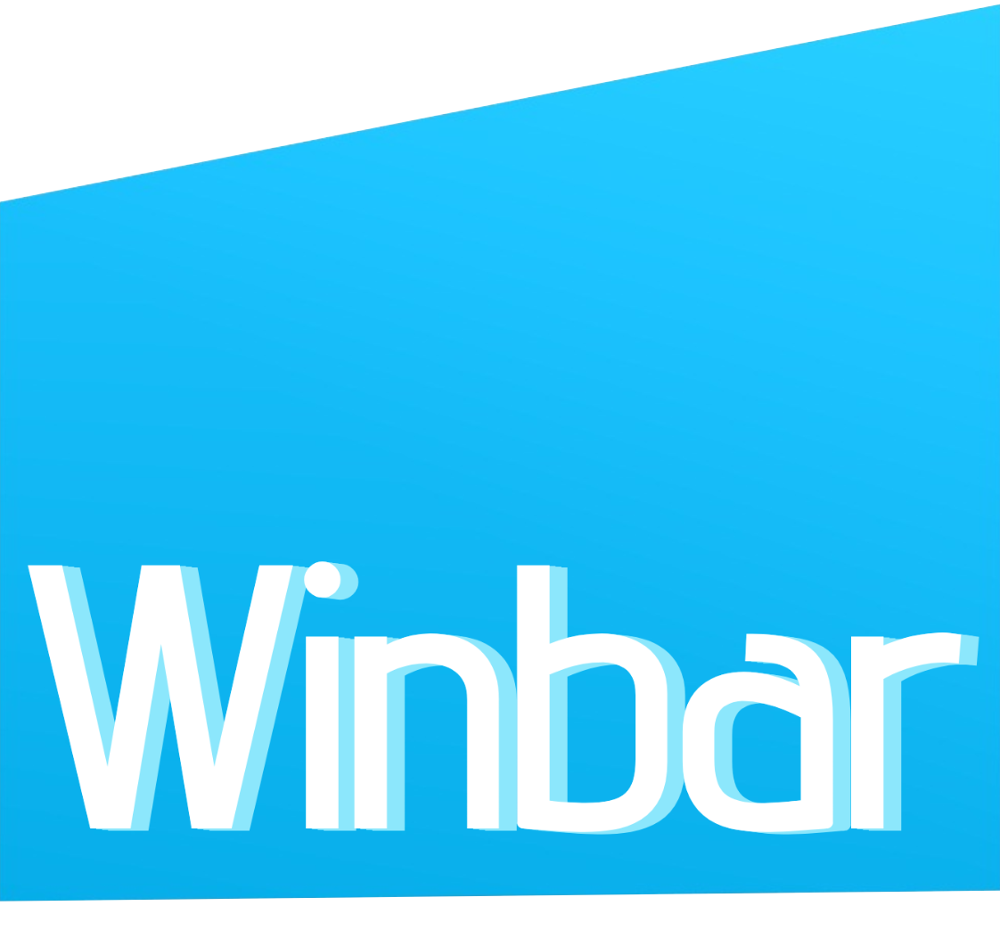
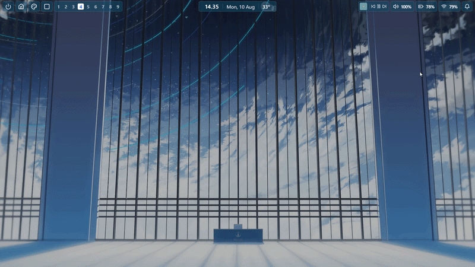
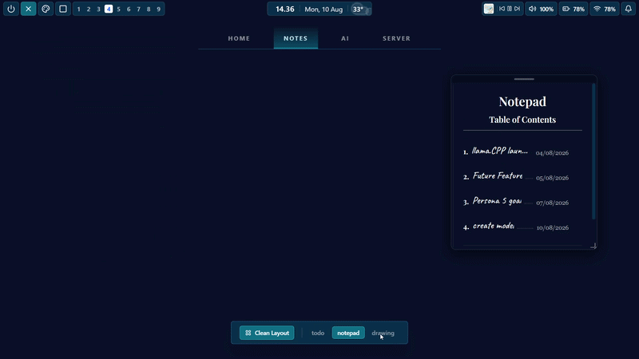
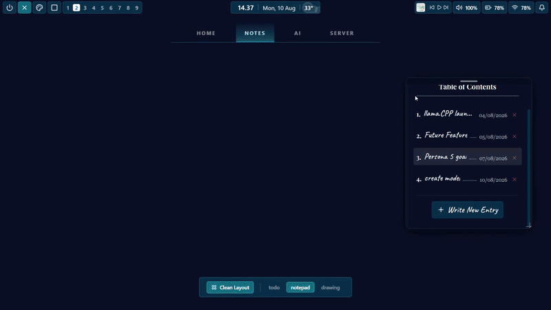
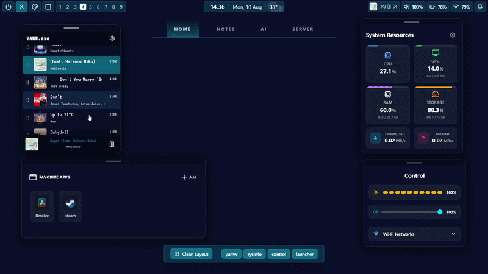
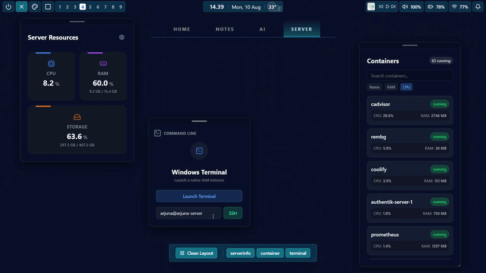

<div align="center">
  
  <br><br>
  
  [](https://github.com/Arjuna-Ragil/winbar/releases)
  [](https://github.com/Arjuna-Ragil/winbar/actions/workflows/release.yaml)
</div>

---

**Winbar (Windows Bar)** is a modern, highly customizable status bar (AppBar) designed for Windows, built on the powerful combination of [Wails](https://wails.io/), Go, and React. Inspired by the sleek, modular top bars often found in Linux desktop environments (like Polybar or Waybar) and other windows status bar (like YASB). Winbar transforms your Windows desktop into a centralized, highly efficient command center tailored exactly to your needs.

## Features

- **Windows AppBar Integration**: Docks seamlessly to the top of your screen, behaving like a native taskbar.
- **Modular Bar Design**: Configure left, center, and right sections of the bar using a simple YAML configuration.
  <div align="center">
    <br>
    
    <br>
    <br>
  </div>
  
- **Changeable & Custom Themes**: Change the theme to your liking. Dont like the default? add your own theme.
  <div align="center">
    <br>
    
    <br>
    <br>
  </div>
  
- **Overlay**: Winbar isn't only a status bar, it has an overlay for the main command center feature with modules
  <div align="center">
    <br>
    
    <br>
    <br>
  </div>
  
- **Tons of Modules Categories**:
  - **Home**: Basic modules categories for your basic need: Music Player (YAMW), App Launcher, System Resources, and System Controls.
  - **Notes**: Modules for taking note, creating a todo list, and a drawing board for your fancy diagram.
  - **AI**: Modules for the next generation of technology, integrate your local AI to winbar.
  - **Server**: Modules for tech enthusiast. Manage & monitor your server with ease.
    
    <div align="center">
      
      
      <br>
      
      
    </div>

- **System Tray**: Manage the app quietly in the background, open configurations, and easily toggle "Run on Launch".
- **Custom Shorcut**: If you have a copilot key (F23), you can change it to open the overlay
- **Modern UI & Fast Performance**: Beautiful and responsive UI using web based tools, with RAM usage under 300MB

## Installation

1. Go to the [Releases](https://github.com/Arjuna-Ragil/winbar/releases) page.
2. Download the executable file
3. **Bypass OS Security Warnings:** Since winbar is an unsigned open-source application, Windows might flag it upon first launch. 
   > If Windows Defender SmartScreen appears, click **More info** > **Run anyway**.   
4. Enjoy your new windows status bar

## Configuration

Winbar is highly configurable via a `config.yaml` file located in the same directory as the executable. If it doesn't exist, the application will create a default one on startup. You can easily open the configuration file by right-clicking the Winbar system tray icon and selecting **"Open Config"**.

### Example `config.yaml`
```yaml
theme: default
left:
- power
- overlay                                           # If the overlay widget is remove, then all modules and overlay feature will be disabled
- theme_toggle
- overlay_toggle
- workspace
center:
- day
right:
- music
- volume
- battery
- wifi
- notification
modules:
- yamw
- sysinfo
- todo
- notepad
- control
- launcher
prometheus_url: http://localhost:9090/              # Insert your server Prometheus URL 
launcher_apps:                                      # insert your application file path
- name: steam                                       # Recommended to add apps from the launcher module, instead of from changing this config file 
  path: C:\Program Files (x86)\Steam\steam.exe
```

## Local Development

### Prerequisites
- [Go](https://go.dev/dl/)
- [Node.js](https://nodejs.org/en/download/) & npm
- [Wails CLI v2](https://wails.io/docs/gettingstarted/installation)

### Build from source
```bash
# Clone the repository
git clone https://github.com/Arjuna-Ragil/winbar.git
cd winbar

# Build the application using Wails
wails build
```
The compiled executable will be located in the `build/bin/` directory.

### Development

To run the application in live-development mode (which enables frontend hot-reloading):
```bash
wails dev
```

### Tech Stack & Dependecies
- **Backend**: The backend logic uses Go (Golang) as the main languange. But, some code part doesn't really follow the go standard since talking with the win32 API (which is using C) needs to follow some C languange rules. This project uses a few library that is free and open-source:
  - [lxn/win](https://github.com/lxn/win)
  - [distatus/battery](https://github.com/distatus/battery)
  - [getlantern/systray](https://github.com/getlantern/systray)
  - [itchyny/volume-go](https://github.com/itchyny/volume-go)
  - [shirou/gopsutil/v4](https://github.com/shirou/gopsutil/v4)
  - [wailsapp/wails/v2](https://github.com/wailsapp/wails/v2)
  
- **Frontend**: React (JS & TS), Vite, TailwindCSS, Excalidraw, Lucide React.

## Thank You For using Winbar
